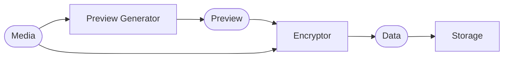

# Tutorial

This tutorial will walk you through creating an application which takes advantage of
PyBooster. Specifically, a media storage app similar to the one described in
[this video](https://www.youtube.com/watch?v=J1f5b4vcxCQ)
by [CodeAesthetic](https://www.youtube.com/@CodeAesthetic). The app will include an
`/upload` endpoint that accepts a file, processes it, and saves it using a blob storage
service. The business of uploading a file will be broken down into several steps where
a preview of the file is generated, the content is encrypted, and the file is saved
to a storage service. Each step will be represented by a separate interface, allowing
for easy testing and modular development. Visually, that should all look something like
this:



## Project Setup

To get started you can initialize a project using [UV](https://docs.astral.sh/uv/):

```bash
uv init
```

Among other things, this will spawn new `pyproject.toml` and `main.py` files.
You'll then want to add a few dependencies:

```bash
uv add litestar pybooster aiocache
```

!!! note

    This tutorial will use [Litestar](https://docs.litestar.dev) for the web framework, but
    you can use any framework you like. The concepts will be the same.

## Basic Server

To the `main.py` file you'll begin by establishing a server with a single `/upload`
route handler that's responsible for processing file uploads. To this you'll specify
the necessary request and response contracts:

```python
from dataclasses import dataclass

from litestar import Litestar
from litestar import put


@dataclass
class UploadRequest:
    content_b64: str
    content_type: str
    storage_name: str


@put("/upload")
async def upload(request: UploadRequest) -> str: ...


app = Litestar(route_handlers=[upload])
```

!!! hint

    See [Litestar's documentation](https://docs.litestar.dev/) for more info on
    the details of defining route handlers.

## Route Logic

To start out you'll want to establishing interfaces that match up with the
components in the diagram above:

```python
from typing import Protocol


class Encryptor(Protocol):
    def encrypt(self, content: bytes) -> bytes: ...


class PreviewGenerator(Protocol):
    def generate(self, content: bytes) -> bytes: ...


class Storage(Protocol):
    async def save(self, prefix: str, data: dict[str, bytes]) -> None: ...
```

You can flesh out the `/upload` route's logic assuming these interfaces exist:

!!! note

    In the next section you'll see how to get instances of these interfaces into the
    route handler using PyBooster.

```python
from base64 import b64decode
from dataclasses import dataclass
from uuid import uuid4

from litestar import put


@dataclass
class UploadRequest:
    content_b64: str
    content_type: str
    storage_name: str


@put("/upload")
async def upload(request: UploadRequest) -> str:
    encryptor: Encryptor = ...
    preview_generators: Mapping[str, PreviewGenerator] = ...
    storages: Mapping[str, Storage] = ...

    raw = b64decode(request.content_b64)
    preview = preview_generators[request.content_type].generate(raw)

    raw_encrypted = encryptor.encrypt(request.content_b64)
    preview_encrypted = encryptor.encrypt(preview)

    prefix = uuid4().hex
    data = {"raw": raw_encrypted, "preview": preview_encrypted}
    await storages[request.storage_name].save(prefix, data)

    return prefix
```

## Injecting Parameters

To inject the interfaces you'll now want to replace the `...` placeholder variables in
the `/upload` route handler with parameters that are resolved using PyBooster. This is
done by adding the [`asyncfunction`][pybooster.core.injector.asyncfunction] decorator
and corresponding [`required`][pybooster.core.injector.required] parameters to the route
handler:

```python
from pybooster import injector
from pybooster import required


@put("/upload")
async def upload(
    request: UploadRequest,
    *,
    encryptor: Encryptor = required,
    preview_generators: Mapping[str, PreviewGenerator] = required,
    storages: Mapping[str, Storage] = required,
) -> str: ...
```

## Providing Implementations

Supplying the implementations for each interface starts by defining
[providers](concepts.md#providers).

```python
from pybooster import provider


@provider.function
def encryptor_provider() -> Encryptor: ...


@provider.function
def preview_generators_provider() -> Mapping[str, PreviewGenerator]: ...


@provider.function
def storages_provider() -> Mapping[str, Storage]: ...
```

!!! note

    The bodies of these providers will be filled in later.

These provider must then be wired together into a [solution](concepts.md#solutions).
Solutions can be relatively expensive to create, so it's best to create them once
at the start of your application and reuse them throughout its lifetime. For this,
there's a Litestar [`lifespan` hook](https://docs.litestar.dev/2/usage/applications.html#lifespan-context-managers),
and a PyBooster [ASGI middleware](integrations.md#asgi-apps).

```python
from pybooster import solution
from pybooster.extra.asgi import PyBoosterMiddleware
from contextlib import asynccontextmanager
from collections.abc import AsyncIterator


@asynccontextmanager
async def lifespan():
    with solution(encryptor_provider, preview_generators_provider, storages_provider):
        yield


app = Litestar(lifespan=[lifespan], middleware=[PyBoosterMiddleware()])
```

At this stage, the providers will be re-evaluated each time a request is made to the
`/upload` route. This is because no [scopes](concepts.md#scopes) have been defined.
In our case there's no
