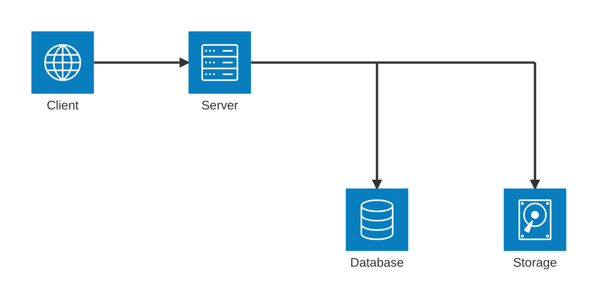

# Tutorial

This tutorial will guide you through the process of creating a "To-Do" application using
PyBooster to facilitate access to various services and resources. The application will
include a basic UI built using [HTMX](https://htmx.org/) and be able to create, read,
update, and delete tasks that support file attachments.

